# Artificial Neural Networks (ANN)

## Neural Networks

From outside, a neural network is just a function. As such, it can take an input and produce an output. This function is highly parameterized and that is of fundamental importance.

A simple neural network typically consists of a set of hidden layers each containing a number of neurons, marked yellow in the picture. The input layer is marked blue.  
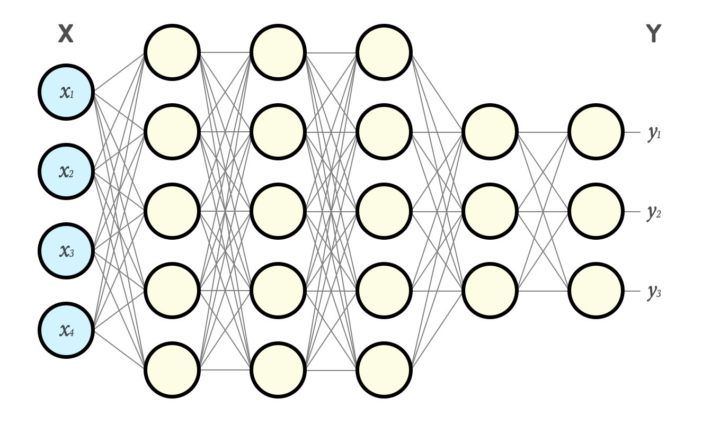  
In the configuration above the input is a vector **X** of size 4 and output is a vector **Y** of size 3.

As you can see in the picture there is a connection between every neuron in one layer to every neuron in the next. Every such connection is in fact a parameter or **weight**. In this example we already have 94 extra parameters in form of **weights**. In bigger networks there can be magnitudes more. Those **weights** will define how the network behaves and how capable it is to transform input to a desired output.

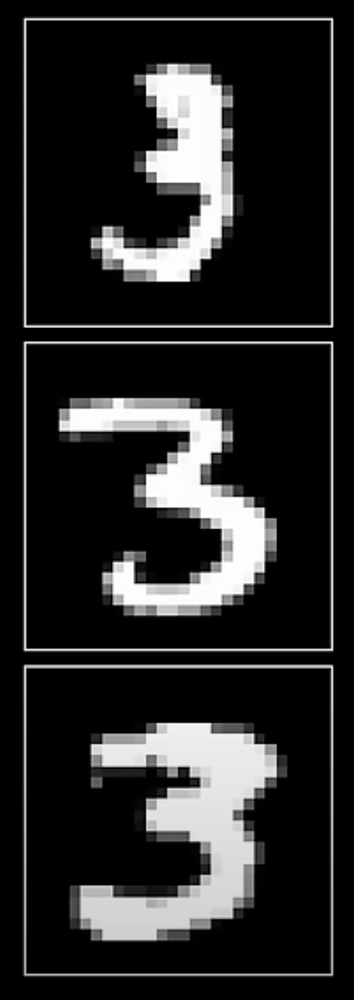

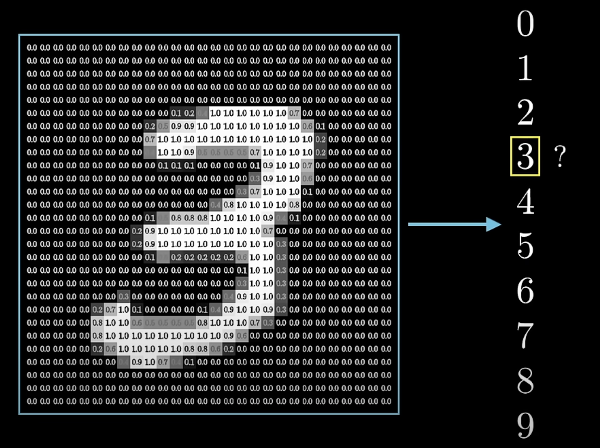

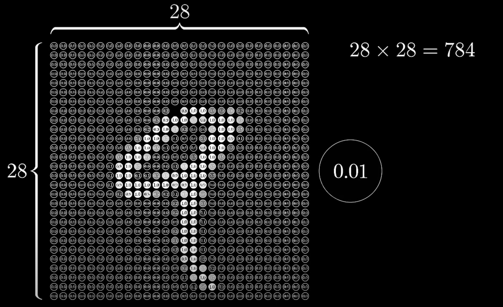

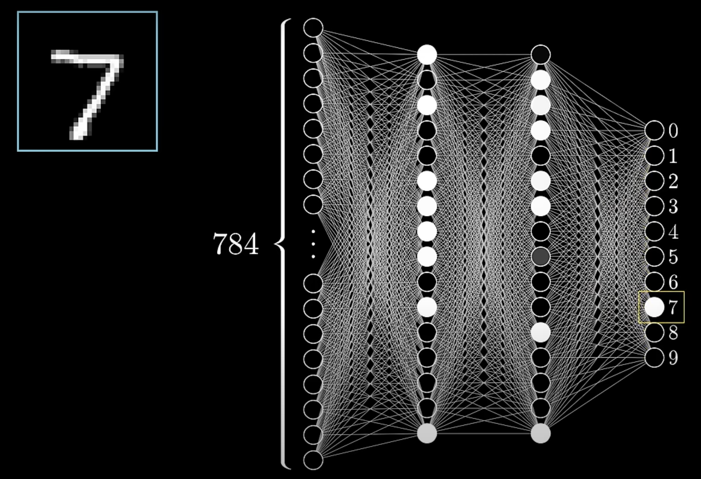

## The Neuron

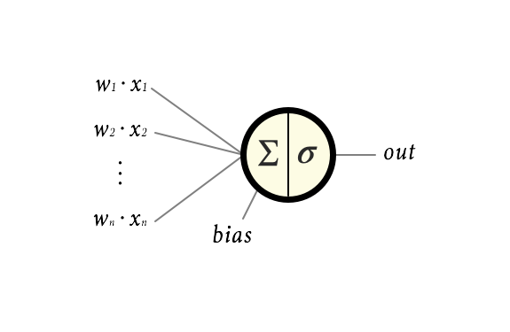

The input to every neuron is the weighted sum of the output from every neuron in the previous layer. In the example this would be:

```
∑ᵢ₌₀ⁿ wᵢ · xᵢ
```

To that we add a scalar value called a **bias**, `b`, which gives a total input to the neuron of:

```
z = (∑ᵢ₌₀ⁿ wᵢ · xᵢ) + b
```

### Activation Function

The input signal is then transformed within the neuron by applying something called an **activation function**, denoted `σ`.

### ReLU

Quite often an activation function called Rectified Linear Unit, or **ReLU**, is used (or variants thereof). The ReLU is simply:

```
ReLU(z) = max(0, z)
```

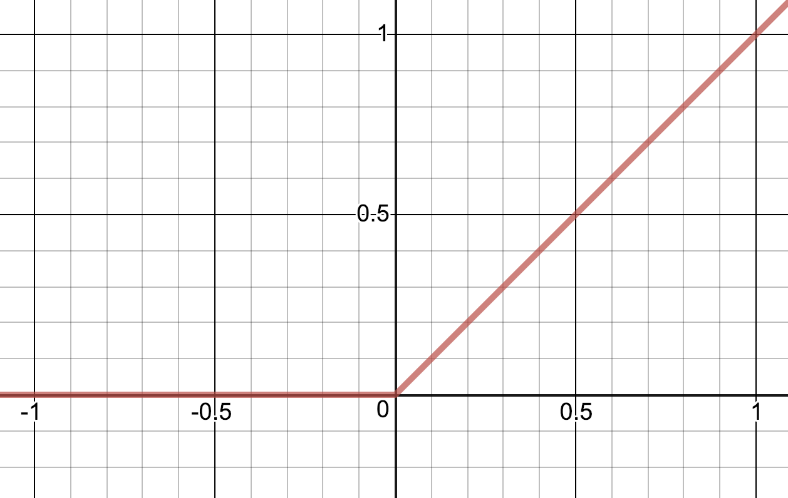

### Sigmoid

Another common activation function is this logistic function, called the **sigmoid function**:

```
σ(z) = 1 / (1 + e^(-z))
```

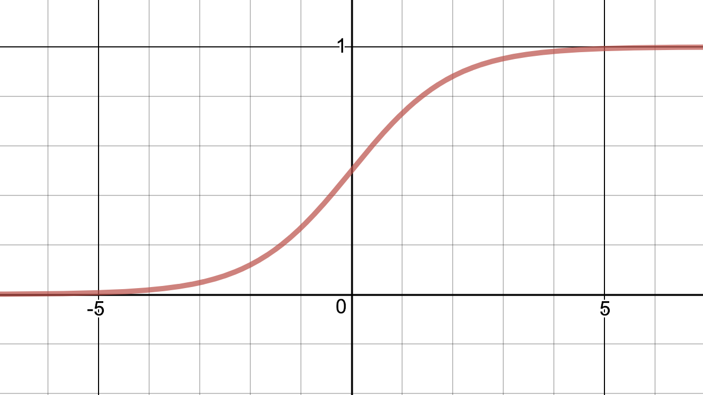

## Comparison: Sigmoid vs ReLU

| Aspect                     | Sigmoid                                              | ReLU                                      |
|----------------------------|------------------------------------------------------|-------------------------------------------|
| **Formula**                | `σ(z) = 1 / (1 + e^(-z))`                            | `ReLU(z) = max(0, z)`                     |
| **Output Range**           | (0, 1)                                               | [0, ∞)                                    |
| **Graph Shape**            | Smooth S-curve                                       | Piecewise linear                          |
| **Computation**            | More complex (uses exponential)                      | Very simple (no exponentials)              |
| **Use Case**               | Output layer for binary classification               | Hidden layers in deep networks            |

## Feed Forward

We simply feed the data through every layer in the network. This is called **feed forward** and it works like this:

Assume that we have chosen the sigmoid function as activation in all layers:

```
σ(z) = 1 / (1 + e^(-z))
```

Now let us, layer by layer, neuron by neuron, calculate what output `y` this network would give on the input vector `x = [2  3]`.

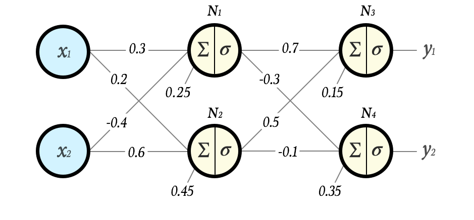

```
N1 = σ(0.3 · 2 + (-0.4) · 3 + 0.25) = σ(-0.35) = 0.41338242108267
N2 = σ(0.2 · 2 + 0.6 · 3 + 0.45) = σ(2.65) = 0.934010990508781
N3 = σ(0.7 · N1 + 0.5 · N2 + 0.15) = σ(0.90637319001226) = 0.712257432295742
N4 = σ((-0.3) · N1 + (-0.1) · N2 + 0.35) = σ(0.132584174624321) = 0.533097573871501
```

Hence, this network produces the output

```
y = [0.7122574322957417  0.5330975738715015]
```

on the input `x = [2  3]`.

If we are lucky, or skilled at setting initial **weights** and **biases**, this might be exactly the output we want for that input. More likely it is not at all what we want. If the latter is the case we can adjust the **weights** and **biases** until we get the output we want.

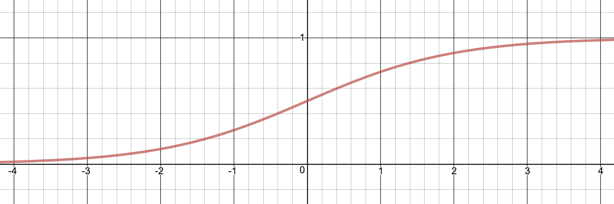  
`σ(x)`

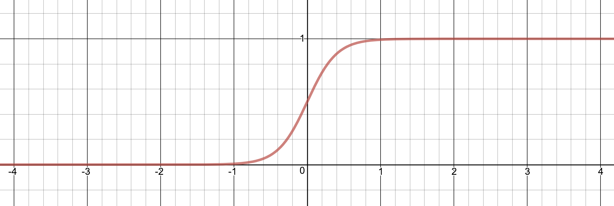  
`σ(5x)`

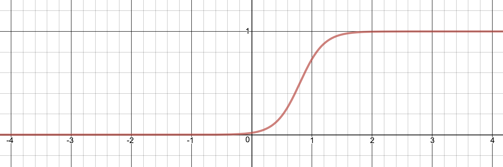  
`σ(5x – 4)`

So by scaling and translating the input to the **activation function** we can move it and stretch it.

## MNIST Dataset
MNIST stands for Modified National Institute of Standards and Technology. It is a classic dataset used for training and testing machine learning models, particularly in image classification tasks. The dataset contains 70,000 grayscale images of handwritten digits (0 to 9), each sized 28×28 pixels. It is widely used as a benchmark in deep learning.


## Training
how a neural network can be trained by using backpropagation and stochastic gradient descent. The theories will be described thoroughly and a detailed example calculation is included where both weights and biases are updated.

We adjust that function by changing weights and the biases but it is hard to change these by hand. They are often just too many and even if they were fewer it would nevertheless be very hard to get good results by hand.

## SUPERVISED LEARNING
The fine thing is that we can let the network adjust this by itself by training the network. This can be done in different ways.
 supervised learning. In this kind of learning we have a dataset that has been labeled –  i.e. we already have the expected output for every input in this dataset.

## Cost, Error, Loss

When training our neural network we feed sample by sample from the training dataset through the network and for each of these we inspect the outcome. In particular we check how much the outcome differs from what we expected – i.e. the label. The difference between what we expected and what we got is called the **Cost** (sometimes this is called **Error** or **Loss**).

There are several different cost functions but we use the quadratic cost function:

```
C = ∑ⱼ(yⱼ – expⱼ)²
```

For example, if we have:

```
exp = [1  0.2]
y = [0.712257432295742  0.533097573871501]
```

Then the cost would be:

```
C = (1 – 0.712257432295742)² + (0.2 – 0.533097573871501)²
  = 0.287742567704258² + (-0.333097573871501)²
  = 0.0827957852690395 + 0.11095399371908007
  = 0.19374977898811957
```

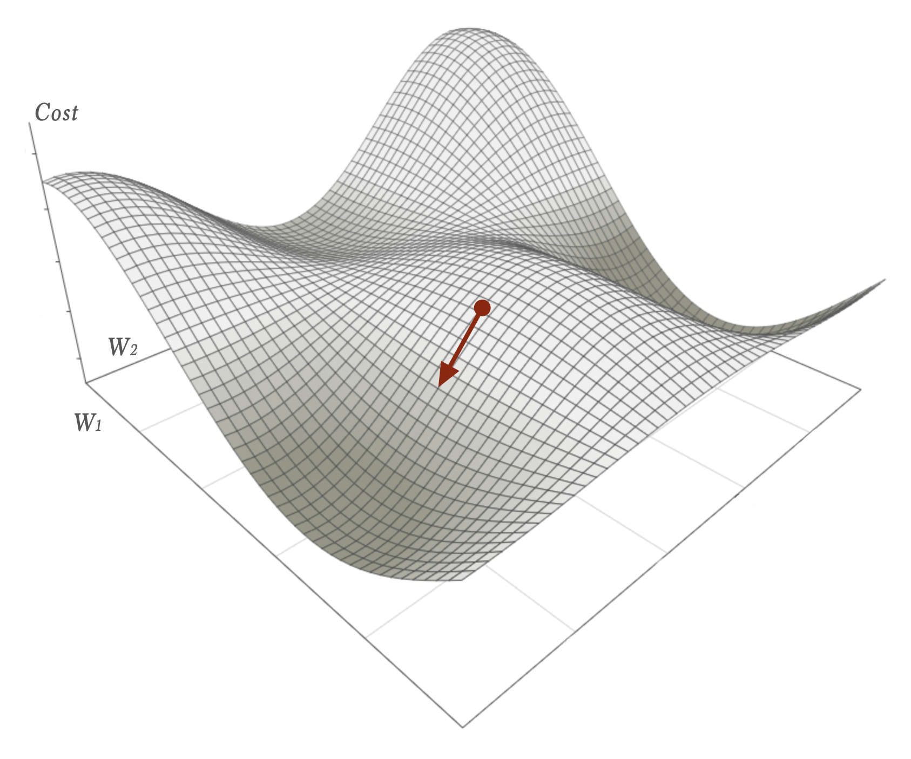

### Gradient Descent

The goal of training a neural network is to find the optimal weights and biases that minimize the cost (or loss) function. Gradient descent is an optimization algorithm used to update the weights in the direction that reduces the cost.

```
w_new = w_old - η * ∇C
```

If we denote the cost function as **C(w₁, w₂, ..., wₙ)**, which depends on all the weights of the network, we compute the gradient of the cost function with respect to the weights:

```
∇C = [∂C/∂w₁, ∂C/∂w₂, ..., ∂C/∂wₙ]
```

The gradient vector points in the direction of greatest increase of the cost function. To minimize the cost, we move in the opposite direction:

```
w_new = w_old - η * ∂C/∂w
```

Here, **η** is a small positive number called the learning rate. It controls how large the steps are during each update.

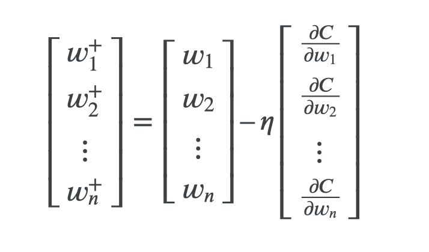

### Partial Derivatives

A partial derivative measures how a multivariable function changes as one of its input variables changes, keeping the others constant.

For example, if we have:

```
f(x, y) = 3x² + 2xy + y²
```

Then:

```
∂f/∂x = 6x + 2y  
∂f/∂y = 2x + 2y
```

These partial derivatives show how the function changes with respect to x and y individually.

### Backpropagation

Backpropagation is the algorithm used to compute the gradients ∂C/∂w for all the weights in the network.

#### Steps:
1. **Feedforward:** Pass the input through the network to get an output.
2. **Calculate Error:** Compare the output to the expected value (label) to compute the cost.
3. **Backpropagate Error:** Use the chain rule of calculus to propagate the error backward through the network, layer by layer.
4. **Update Weights:** Use gradient descent to update the weights and biases based on the computed gradients.

Backpropagation efficiently calculates how each weight contributed to the error, allowing us to improve the network by adjusting those weights accordingly.

## Resources:
https://en.wikipedia.org/wiki/Neural_network_(machine_learning)

https://machinelearning.tobiashill.se

http://neuralnetworksanddeeplearning.com

https://www.youtube.com/watch?v=aircAruvnKk

https://www.cs.cmu.edu/~pvirtue/tfp/

https://machinelearning.tobiashill.se/2019/01/28/extra-2-a-mnist-playground/