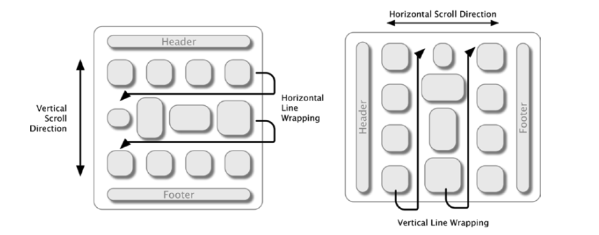

# UICollectionViewLayout

## 1. UICollectionViewFlowLayout Introduction
- `UICollectionViewFlowLayout` is a class to arrange cells in a UICollectionView.
- It arranges cells in **rows and columns**.

## 2. Basic Concepts
- A UICollectionView has:
  - **Cells**: show the main content
  - **Sections**: group cells
  - **Supplementary Views**: headers and footers
- FlowLayout controls how cells are placed in rows and columns.

You can think of FlowLayout like displaying a sentence. If the sentence is long, it moves to the next line. Similarly, cells fill the first row, then move to the second row, and so on. The scroll direction changes how rows are filled: vertical scroll fills row by row, and horizontal scroll fills column by column.

## 3. Some Attributes
- The size of cells is set by `itemSize`.
    - Cells can have **fixed or dynamic** sizes.
    - Use `estimatedItemSize` for dynamic content.
    - Auto Layout can automatically calculate the cell size.

- Spacing between cells is controlled by:
  - `minimumLineSpacing` → space between rows
  - `minimumInteritemSpacing` → space between columns
  - `sectionInset` → margin around a section
- You can set different spacing for each section.

- `scrollDirection` sets UICollectionView to scroll **vertically** or **horizontally**.
    - Default is **vertical**.
    - You can adjust cell layout for each scroll direction.

## 4. Section Headers and Footers
- Sections can have **headers and footers**.
- `headerReferenceSize` and `footerReferenceSize` set their size.
- `sectionHeadersPinToVisibleBounds = true` → header stays at the top when scrolling.

## 5. Delegate Methods (UICollectionViewDelegateFlowLayout)
- You can set size and spacing for each cell or section:
  - `sizeForItemAt` → cell size
  - `insetForSectionAt` → section margin
  - `minimumLineSpacingForSectionAt` → row spacing
  - `minimumInteritemSpacingForSectionAt` → column spacing
  - `referenceSizeForHeaderInSection` → header size
  - `referenceSizeForFooterInSection` → footer size

## 6. Advanced Layout Adjustments
- Cell size can **change based on content**.
- Each section can have **different spacing and size**.
- You can modify **LayoutAttributes** to change cell appearance.
- Use `invalidateLayout()` and `performBatchUpdates()` to apply changes.

## 7. Supplementary and Decoration Views
- Types of views in CollectionView:
  - **Cells** → main content
  - **Supplementary Views** → header and footer
  - **Decoration Views** → background or custom design
- Decoration Views can make section backgrounds look nicer.

## 8. Customizing Flow Layout
- You can **subclass UICollectionViewLayout**.
- Methods (or Variables) to override:
    - `prepare()`
    - `collectionViewContentSize`
    - `layoutAttributesForElements(in:)`
    - `layoutAttributesForItem(at:)`
    - `shouldInvalidateLayout(forBoundsChange:)`
    - `layoutAttributesForDecorationView(ofKind:)`
    - `layoutAttributesForSupplementaryView(ofKind:)`

By creating a custom class, we can change all features of the layout and control how elements are displayed. For example, FlowLayout normally arranges cells horizontally or vertically, but with a custom layout, we could arrange cells in a circle or other shapes. Creating a custom layout may seem difficult at first because we need to calculate everything ourselves. This includes the positions of cells and other layout behaviors. We will talk more about these calculations and features in the next parts.

To create a subclass of `UICollectionViewLayout`:
- Create a subclass of `UICollectionViewLayout`.
- Create a subclass of `UICollectionViewLayoutAttributes` if you want to add extra features to the views. This step is optional.
- Create functions to add or remove cells, supplementary views, or decoration views. These functions are also optional.

For a UICollectionView, it does not matter when we calculate the layout attributes. The important point is that these calculations are used when the layout calls the `layoutAttributesForElements` function. We need to return an array of attributes in this function.
We can take two approaches:
- If there are many items or the sizes are dynamic, we can calculate the attributes when the function is called.
- If the items are fixed or the sizes are constant, we can do the calculations inside the `prepare` function.
We will talk more about these two functions later.

Every custom layout must do three things. First, it must calculate the size of each item and determine how much space it needs. Second, it must calculate the position of each item and decide where it should be placed. Third, it must return an array that contains all the layout attributes.

What are attributes?
Attributes are a set of standard properties that each view might need. These include `frame`, `bounds`, `center`, `size`, `transform3D`, `transform`, `alpha`, `zIndex`, and `hidden`.
If we want to add extra properties beyond these standard ones, we need to create a subclass of `UICollectionViewLayoutAttributes`.

In a custom layout, we have four important functions:
- `prepare()`
- `collectionViewContentSize`
- `layoutAttributesForElements(in rect: CGRect)`
- `layoutAttributesForItem(at indexPath: IndexPath)`

These functions are essential for calculating and providing the layout attributes for the collection view.

### prepare
This step is for preparing the layout. It runs before calculating the attributes. Inside this function, we can do general and fixed calculations.
This function can be called multiple times, usually after calling `collectionViewLayout.invalidateLayout()`, for example when the device rotates.

### collectionViewContentSize
This property tells the collection view how much content it should display, meaning the total size of all the items.

### layoutAttributesForElements
In this function, we calculate where each item should be placed and how much space it will take.

### layoutAttributesForItem
In this function, the collection view asks for the attributes of a specific item, for example item 7. **We should not do any calculations here**. Instead, we just use the results from previous calculations.

We have two other types of views besides cells.
- Supplementary views include headers and footers.
- Decoration views include backgrounds or separator lines.

---

So far, we have introduced and learned about the functions. From now on, we will create a simple example of a custom layout. The source code for the project is included alongside this file.