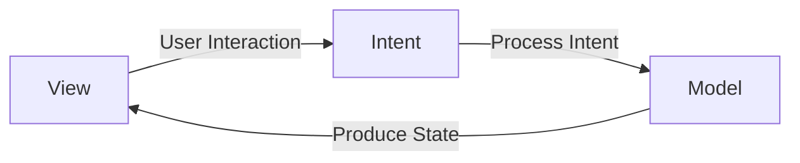
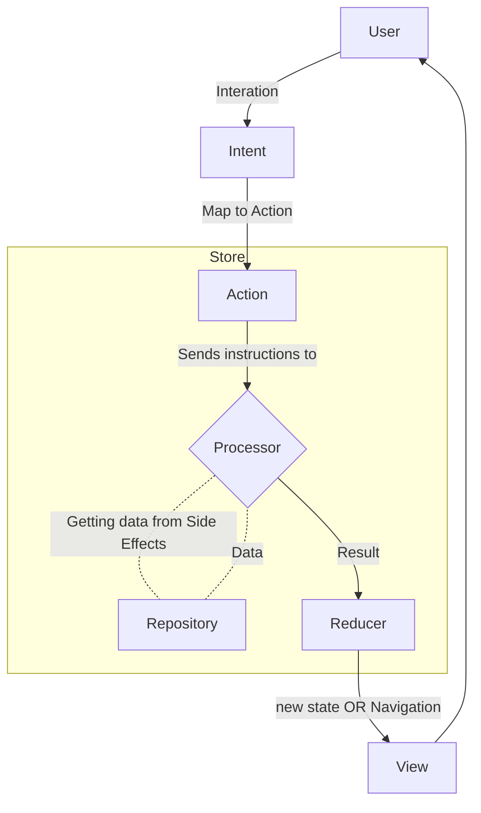

# MVI Architecutre

## Table of Contents

- What is MVI?
- Deep Dive into MVI
- Create Porject with MVI
- Cons
- References

## What is MVI?



MVI (Model–View–Intent) is an architectural pattern based on unidirectional data flow, meaning data moves in a single direction through the system. User actions (Intents) are processed by the business logic layer (like a ViewModel or Reducer), which produces a new State (Model). The View observes this state and updates the UI accordingly. Unlike bidirectional architectures like MVC or MVVM with data binding, MVI promotes clarity, testability, and predictability by ensuring that state changes always follow a clear, one-way path from user interaction to state update to UI rendering.

## Deep Dive into MVI

User Intents are mapped to Actions that define what the system should do, regardless of the user's original intent. These Actions are sent to a Processor, which performs the core logic—such as fetching data or triggering navigation—and returns the outcome as a Result. The Result is then reduced into a new ViewState, updating properties like loading status or inserting new data. Finally, this updated ViewState is passed to the View, which re-renders accordingly.



## Create Porject with MVI

From this point on, we move on to coding, and all code will be written in Xcode. Therefore, this section will remain empty.

The code is written step by step in the following sections.

### Code: Step by Step

#### Step Zero: init

In the first step, we build a simple UI with the ability to increase and decrease a counter.

```swift
struct CounterView: View {
    
    @State private var count: Int = 0
    
    var body: some View {
        VStack(spacing: 20) {
            Text("count is \(count)")
                .font(.largeTitle)
                .fontWeight(.bold)
            
            Stepper("Change Counter with theses buttons") {
                count += 1
            } onDecrement: {
                count -= 1
            }
        }
    }
}
```

#### Step one: Add viewModel

we use a ViewModel to improve the code structure, moving the counter into the ViewModel. The changes will be as follows.

```swift
@Observable
final class CounterViewModel {
    
    var count: Int = 0
    
    func increment() {
        count += 1
    }
    
    func decrement() {
        count -= 1
    }
}

struct CounterView: View {
    
    @State private var viewModel = CounterViewModel()
    
    var body: some View {
        VStack(spacing: 20) {
            Text("count is \(viewModel.count)")
                .font(.largeTitle)
                .fontWeight(.bold)
            
            Stepper("Change Counter with theses buttons") {
                viewModel.increment()
            } onDecrement: {
                viewModel.decrement()
            }
        }
    }
}
```

#### Step Two: Add MVI Base

we create all the necessary components required for MVI, which includes some protocols.  
At this stage, we won't be using a repository yet.

```swift
protocol MVIIntent {
    associatedtype Action: MVIAction
    
    func mapToAction() -> Action
}

protocol MVIAction {
    
}

protocol MVIResult {
    
}

protocol MVIProcessor {
    associatedtype Action: MVIAction
    associatedtype Result: MVIResult
    
    func process(_ action: Action) -> Result
}

protocol MVIState {
    
}

protocol MVIReducer {
    associatedtype Result: MVIResult
    associatedtype State: MVIState
    
    func reduce(_ result: Result, currentState state: State) -> State
}


protocol MVIStore: AnyObject {
    associatedtype Reducer: MVIReducer
    associatedtype Processor: MVIProcessor
    associatedtype Action: MVIAction where Action == Processor.Action
    associatedtype State: MVIState where State == Reducer.State
    
    var reducer: Reducer { get }
    var processor: Processor { get }
    var state: State { get }
    
    func send(_ action: Action)
}
```

Now, we implement all the required conformances for the protocols.

```swift
enum CounterIntent: MVIIntent {
    case userIncremented
    case userDecremented
    
    func mapToAction() -> CounterAction {
        return switch self {
        case .userIncremented: .increment
        case .userDecremented: .decrement
        }
    }
}

enum CounterAction: MVIAction {
    case increment
    case decrement
}

enum CounterResult: MVIResult {
    case counterUpdated(Int)
}

struct CounterProcessor: MVIProcessor {
    typealias Action = CounterAction
    typealias Result = CounterResult
    
    func process(_ action: CounterAction) -> CounterResult {
        return switch action {
        case .increment: .counterUpdated(1)
        case .decrement: .counterUpdated(-1)
        }
    }
}

struct CounterState: MVIState {
    var count: Int = 0
}

struct CounterReducer: MVIReducer {
    typealias Result = CounterResult
    typealias State = CounterState
    
    func reduce(_ result: CounterResult, currentState state: CounterState) -> CounterState {
        var newState = state
        
        switch result {
        case .counterUpdated(let int):
            newState.count += int
        }
        
        return newState
    }
}

@Observable
final class CounterStore: MVIStore {
    typealias Reducer = CounterReducer
    typealias Processor = CounterProcessor
    typealias Action = CounterAction
    typealias State = CounterState
    
    var processor = CounterProcessor()
    var reducer = CounterReducer()
    var state = CounterState()
    
    func send(_ action: CounterAction) {
        let result = processor.process(action)
        state = reducer.reduce(result, currentState: state)
    }
}
```

Now, we update the ViewModel based on the MVI pattern.

```swift
@Observable
final class CounterViewModel {
    
    var store: CounterStore = CounterStore()
    
    var state: CounterState {
        store.state
    }
    
    func send(_ intent: CounterIntent) {
        let action = intent.mapToAction()
        store.send(action)
    }
}
```

And we also make the necessary changes in the view.

```swift
struct CounterView: View {
    
    @State private var viewModel = CounterViewModel()
    
    var body: some View {
        VStack(spacing: 20) {
            Text("count is \(viewModel.state.count)")
                .font(.largeTitle)
                .fontWeight(.bold)
            
            Stepper("Change Counter with theses buttons") {
                viewModel.send(.userIncremented)
            } onDecrement: {
                viewModel.send(.userDecremented)
            }
        }
    }
}
```

#### Step three: Add Test

In this step, we write tests for all the components: processor, store, and reducer.

```swift
struct CounterTests {
    
    // processor
    @Test
    func processorIncrement() {
        let processor = CounterProcessor()
        let result = processor.process(.increment)
        #expect(result == .counterUpdated(1))
    }
    
    @Test
    func processorDecrement() {
        let processor = CounterProcessor()
        let result = processor.process(.decrement)
        #expect(result == .counterUpdated(-1))
    }
    
    // reducer
    @Test
    func reducerAddsCorrectly() {
        let reducer = CounterReducer()
        let state = CounterState(count: 2)
        let result = CounterResult.counterUpdated(3)
        let newState = reducer.reduce(result, currentState: state)
        #expect(newState.count == 5)
    }
    
    @Test
    func reducerSubtractsCorrectly() {
        let reducer = CounterReducer()
        let state = CounterState(count: 5)
        let result = CounterResult.counterUpdated(-2)
        let newState = reducer.reduce(result, currentState: state)
        #expect(newState.count == 3)
    }
    
    // store
    @Test
    func testStoreFlow() {
        let store = CounterStore()
        #expect(store.state.count == 0)
        
        store.send(.increment)
        #expect(store.state.count == 1)
        
        store.send(.decrement)
        #expect(store.state.count == 0)
        
        store.send(.decrement)
        #expect(store.state.count == -1)
    }
}
```

#### Step Four: add Extra Logic

In the next step, we want to add logic to the code to prevent negative values.

Now, the reducer and test code will be as follows.

```swift

// reducer
struct CounterReducer: MVIReducer {
    typealias Result = CounterResult
    typealias State = CounterState
    
    func reduce(_ result: CounterResult, currentState state: CounterState) -> CounterState {
        var newState = state
        
        switch result {
        case .counterUpdated(let int):
            //newState.count += int
            newState.count = max(0, newState.count + int)
        }
        
        return newState
    }
}


// test file
@Test
    func testStoreFlow() {
        let store = CounterStore()
        #expect(store.state.count == 0)
        
        store.send(.increment)
        #expect(store.state.count == 1)
        
        store.send(.decrement)
        #expect(store.state.count == 0)
                
        store.send(.decrement)

        // changes here
        // #expect(store.state.count == -1)
        #expect(store.state.count != -1)

        // changes here
        store.send(.decrement)
        #expect(store.state.count == 0)
    }
```

#### Step Five: add repository

Now, we want to use a repository.

To do this, we need to have a network inside the processor.
For this, we will create a CounterNetwork, and the changes in the processor will be as follows.

```swift
struct CounterNetwork {
    
    func fetchMultipleCount() -> Int {
        return 10
    }
}

struct CounterProcessor: MVIProcessor {
    typealias Action = CounterAction
    typealias Result = CounterResult
    
    // new line
    private var counterNetwork = CounterNetwork()
    
    func process(_ action: CounterAction) -> CounterResult {
        return switch action {
//        case .increment: .counterUpdated(1)
        case .increment: .counterUpdated(counterNetwork.fetchMultipleCount())
//        case .decrement: .counterUpdated(-1)
        case .decrement: .counterUpdated(counterNetwork.fetchMultipleCount() * -1)
        }
    }
}
```

The changes in the test file will be as follows.

```swift
    @Test
    func processorIncrement() {
        let processor = CounterProcessor()
        let result = processor.process(.increment)
//        #expect(result == .counterUpdated(1))
        #expect(result == .counterUpdated(10))
    }
    
    @Test
    func processorDecrement() {
        let processor = CounterProcessor()
        let result = processor.process(.decrement)
//        #expect(result == .counterUpdated(-1))
        #expect(result == .counterUpdated(-10))
    }

    @Test
    func testStoreFlow() {
        let store = CounterStore()
        #expect(store.state.count == 0)
        
        store.send(.increment)
        // #expect(store.state.count == 1)
        #expect(store.state.count == 10)
        
        store.send(.decrement)
        #expect(store.state.count == 0)
        
        store.send(.decrement)
        #expect(store.state.count != -1)
        
        store.send(.decrement)
        #expect(store.state.count == 0)
    }
```

#### step Six: add detail and navigation

In the final step, we need to implement navigation. To achieve navigation, we proceed as follows.

```swift
struct DetailView: View {
    var body: some View {
        Text("Hello, World!")
    }
}

// new
protocol MVINavigator {
    
}

protocol MVIStore: AnyObject {
    associatedtype Reducer: MVIReducer
    associatedtype Processor: MVIProcessor
    associatedtype Action: MVIAction where Action == Processor.Action
    associatedtype State: MVIState where State == Reducer.State
    associatedtype Navigator: MVINavigator // new
    
    var reducer: Reducer { get }
    var processor: Processor { get }
    var state: State { get }
    var navigator: Navigator { get } // new
    
    func send(_ action: Action)
}

// new
enum CounterNavigator: MVINavigator {
    case navigateToDetail
}

// new extension
extension NavigationPath: MVINavigator { }

@Observable
final class CounterStore: MVIStore {
    typealias Reducer = CounterReducer
    typealias Processor = CounterProcessor
    typealias Action = CounterAction
    typealias State = CounterState
    typealias Navigator = NavigationPath // new
    
    var processor = CounterProcessor()
    var reducer = CounterReducer()
    var state = CounterState()
    var navigator = NavigationPath() // new
    
    func send(_ action: CounterAction) {
        let result = processor.process(action)
        
        // new lines
        switch result {
        case .navigateToDetail:
            navigator.append(CounterNavigator.navigateToDetail)
            
        default:
            state = reducer.reduce(result, currentState: state)
        }        
    }
}

enum CounterIntent: MVIIntent {
    case userIncremented
    case userDecremented
    case navigateToDetail // new
    
    func mapToAction() -> CounterAction {
        return switch self {
        case .userIncremented: .increment
        case .userDecremented: .decrement
        case .navigateToDetail: .navigateToDetail // new
        }
    }
}

enum CounterAction: MVIAction {
    case increment
    case decrement
    case navigateToDetail // new
}

enum CounterResult: MVIResult, Equatable {
    case counterUpdated(Int)
    case navigateToDetail // new
    
    static func ==(lhs: Self, rhs: Self) -> Bool {
        switch (lhs, rhs) {
        case (.counterUpdated(let lhsValue), .counterUpdated(let rhsValue)):
            return lhsValue == rhsValue
        case (.goToDetail, .goToDetail): // new
            return true
        default: // new
            return false
        }
    }
}

struct CounterProcessor: MVIProcessor {
    typealias Action = CounterAction
    typealias Result = CounterResult
    
    private var counterNetwork = CounterNetwork()
    
    func process(_ action: CounterAction) -> CounterResult {
        return switch action {
//        case .increment: .counterUpdated(1)
        case .increment: .counterUpdated(counterNetwork.fetchMultipleCount())
//        case .decrement: .counterUpdated(-1)
        case .decrement: .counterUpdated(counterNetwork.fetchMultipleCount() * -1)
        case .navigateToDetail: .navigateToDetail // new
        }
    }
}

var body: some View {
        NavigationStack(path: $viewModel.store.navigator) { // new
            VStack(spacing: 20) {
                Text("count is \(viewModel.state.count)")
                    .font(.largeTitle)
                    .fontWeight(.bold)
                
                Stepper("Change Counter with theses buttons") {
                    viewModel.send(.increment)
                } onDecrement: {
                    viewModel.send(.decrement)
                }
                
                // new lines
                Button("Go to Detail") {
                    viewModel.send(.goToDetail)
                }
                .navigationDestination(for: CounterNavigator.self) { navigator in
                    switch navigator {
                    case .navigateToDetail:
                        DetailView()
                    }
                }
            }
        }
    }

    @Test
    func processorNavigation() {
        let processor = CounterProcessor()
        let result = processor.process(.goToDetail)
        #expect(result == .goToDetail)
    }
```

You can view all the code inside the project file.

## Cons

One of the main drawbacks of the MVI architecture is the large number of components required even for a single view. Although MVI provides clear structure and better state management, it often leads to more boilerplate code and a longer development time. Developers may need to create multiple files and layers, such as intents, models, and state handlers, just to support one screen. This added complexity can slow down the development process, especially for smaller features or simple UI components.

## References

- [MVI - The Good, the Bad, and the Ugly](https://adambennett.dev/2019/07/mvi-the-good-the-bad-and-the-ugly/)
- [MVI Architecture with Android](https://medium.com/swlh/mvi-architecture-with-android-fcde123e3c4a)
- [Unidirectional Data Flow in React](https://flaviocopes.com/react-unidirectional-data-flow/)
- [Separation of Concerns in Software Design](https://nalexn.github.io/separation-of-concerns/)