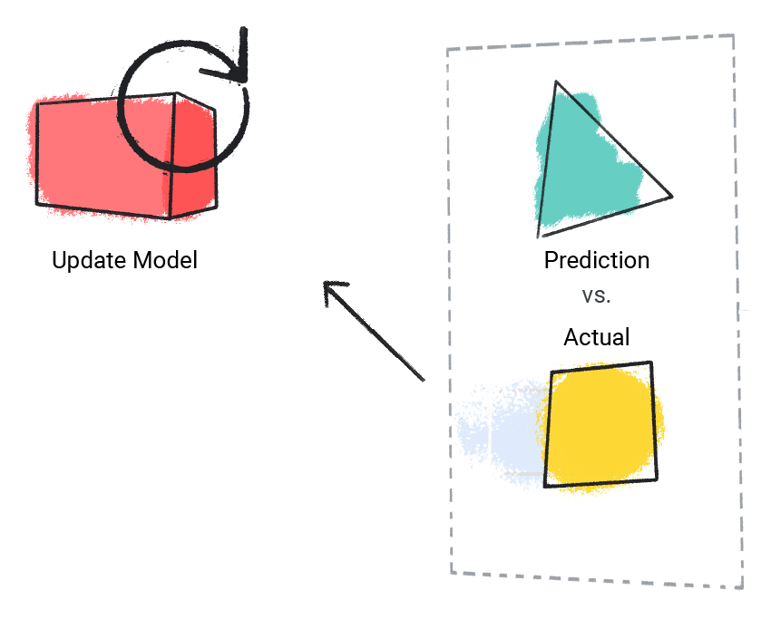

# Comprehensive Machine Learning Presentation

## Table of Contents
1. [Introduction to Machine Learning](#introduction-to-machine-learning)
   - [Types of Machine Learning](#types-of-machine-learning)
   - [Supervised Learning](#supervised-learning)
     - [Regression](#regression)
     - [Classification](#classification)
   - [Unsupervised Learning](#unsupervised-learning)
     - [Common Applications](#common-applications)
     - [Real-World Example: Weather Pattern Clustering](#real-world-example-weather-pattern-clustering)
   - [Reinforcement Learning](#reinforcement-learning)
   - [Generative AI](#generative-ai)
     - [How Does Generative AI Work?](#how-does-generative-ai-work)
     - [Training Process](#training-process)
     - [Real-World Analogies](#real-world-analogies)
     - [Business Applications](#business-applications)
     - [Future Potential](#future-potential)
2. [Foundational Supervised Learning Concepts](#foundational-supervised-learning-concepts)
   - [Data](#data)
   - [Model](#model)
   - [Training Process](#training-process)
   - [Evaluation](#evaluation)
   - [Inference](#inference)
3. [Linear Regression](#linear-regression)
   - [Linear Regression Equation](#linear-regression-equation)
4. [Linear Regression: Loss](#linear-regression-loss)
   - [Types of Loss](#types-of-loss)
5. [Gradient Descent](#gradient-descent)

## Introduction to Machine Learning

> **Machine Learning (ML)** is the process of training a piece of software, called a **model**, to make useful predictions or generate content from data.

### Types of Machine Learning

#### 1. Supervised Learning
- models can make predictions after seeing lots of data with the correct answers and then discovering the connections between the elements in the data that produce the correct answers.
- This is like a student learning new material by studying old exams that contain both questions and answers. Once the student has trained on enough old exams, the student is well prepared to take a new exam.

### Two of the most common use cases for supervised learning are regression and classification:

### Regression
A regression model predicts a numeric value. For example, a weather model that predicts the amount of rain, in inches or millimeters, is a regression model.

Here are some examples of regression models:

| Scenario | Possible Input Data | Numeric Prediction |
|----------|-------------------|-------------------|
| Future House Price | Square footage, zip code, number of bedrooms and bathrooms, lot size, mortgage interest rate, property tax rate, construction costs, and number of homes for sale in the area | The price of the home |
| Future Ride Time | Historical traffic conditions (gathered from smartphones, traffic sensors, ride-hailing and other navigation applications), distance from destination, and weather conditions | The time in minutes and seconds to arrive at a destination |

### Classification
Classification models predict the likelihood that something belongs to a category. Unlike regression models, whose output is a number, classification models output a value that states whether or not something belongs to a particular category. For example:
- Predicting if an email is spam or not
- Determining if a photo contains a cat
- Identifying fraudulent transactions

Classification models come in two varieties:

1. **Binary Classification**
   - Outputs a value from exactly two possible classes
   - Example: A weather model that predicts either "rain" or "no rain"
   
2. **Multiclass Classification**
   - Outputs a value from three or more possible classes
   - Example: A weather model that predicts "rain", "sunny", "snow", or "sleet"

#### 2. Unsupervised Learning
Unsupervised learning is a fascinating branch of machine learning where models learn from unlabeled data by discovering hidden patterns and structures. Unlike supervised learning, there are no "correct answers" to guide the learning process. (Like Clusternig Customers Purchase Behavior)

Think of unsupervised learning like sorting a big pile of mixed fruits:

- You don't tell the computer what each fruit is beforehand
- The computer looks at things like color, size, and shape
- It puts similar fruits together in groups by itself
- It learns to spot patterns on its own

**What is Clustering?**
Clustering is like sorting items into boxes:
   - Put similar things in the same box
   - Each box has items that look alike
   - For example: Putting red round fruits in one box, yellow long fruits in another

### Simple Weather Example ☔

Let's say we have weather data with temperature and rain measurements. The computer will:
1. Look at all the weather readings
2. Group similar weather days together

  

  <em>Figure 3: The computer groups similar weather days together</em>

After looking at these groups, we can see what kind of weather each group represents:

  

  <em>Figure 4: We can see that each group matches a type of weather - snow, sleet, rain, or no rain</em>

So in simple terms, the computer:
- Finds patterns by itself, like a detective
- Creates groups of similar things
- Helps us understand our data better without being told what to look for

#### 3. Reinforcement Learning
- The model learns by trial and error, receiving rewards or penalties
- Used in game playing, train robots to perform tasks like walking around a room.

#### 4. Generative AI
Generative AI represents a revolutionary class of machine learning models that can create new content based on patterns learned from existing data. These models have transformed how we interact with AI, enabling creation of text, images, code, and more.
### What is Generative AI and How Does it Work?

Let's break down Generative AI in simple terms:

Imagine you have a really smart student who:
1. First studies lots of examples to understand patterns (like studying many books to learn writing)
2. Then tries to create something new using what they learned (like writing their own story)
3. Finally, follows specific instructions to make exactly what you want (like writing a story about pirates)

### Two Main Steps in Training

1. **Learning Phase**
   - The AI looks at millions of examples
   - For instance, if teaching AI about cats, it looks at millions of cat pictures
   - It starts noticing things like "cats have pointy ears", "cats have whiskers", etc.

2. **Creation Phase**
   - After learning, the AI can create new things
   - If you ask for a cat picture, it uses what it learned about cats
   - It puts together features like pointy ears, whiskers, and fur to make a new cat image

### Simple Examples You Can Relate To

Think of it like:
- A child learning to draw by looking at many drawings, then making their own
- A cook tasting many pizzas, then learning to make their own pizza
- Someone learning English by reading many books, then writing their own stories

## Foundational Supervised Learning Concepts
Supervised machine learning is built on five key pillars:

### 1. Data
- The foundation of machine learning
- Organized in datasets (e.g., cat images, housing prices, weather data)
- Each example contains:
  - Features (input values used for prediction)
  - Label (the "answer" we want to predict)

Example Dataset:
| Bedrooms | Bathrooms | House Age | Price (Label) |
|----------|-----------|-----------|---------------|
| 3        | 2         | 15        | $345,000      |
| 2        | 1         | 72        | $179,000      |
| 4        | 2         | 34        | $392,000      |

#### Dataset Quality Factors:
- **Size**: Number of examples
- **Diversity**: Range of examples covered
- **Feature Count**: More features can lead to better patterns
  - Example: Weather datasets with hundreds of features (satellite imagery, cloud coverage)
  - vs simpler datasets with few features (humidity, pressure, temperature)

### 2. Model
The model is:
- A complex mathematical system that processes data
- The core component that maps input features to output labels 
- Trained to learn patterns from examples

### 3. Training Process
The model learns by:
1. Taking labeled examples as input
2. Making predictions
3. Comparing predictions to actual values
4. Adjusting its approach based on errors
5. Repeating with more examples

  

  <em>Model making initial predictions from labeled examples</em>

  

  <em>Model comparing and updating predictions based on actual values</em>

  

  <em>Model learning iteratively from multiple examples in the training dataset</em>

### 4. Evaluation
- Test model performance on new labeled data
- Compare predictions with actual values
- Determine if more training is needed

  

  <em>Evaluation workflow: Model predictions vs actual values to assess performance</em>

### 5. Inference
- Using trained model on new, unlabeled data
- Real-world application (e.g., weather prediction)
- Model applies learned patterns to make predictions
  - Example: Predicting rainfall from current conditions like temperature, pressure, and humidity

> 💡 **Key Takeaway**: Success in supervised learning depends on quality data, effective training, thorough evaluation, and proper deployment for real-world predictions.

### Linear Regression
Linear regression is a statistical technique used to find the relationship between variables. In an ML context, linear regression finds the relationship between features and a label.

For example, suppose we want to predict a car's fuel efficiency in miles per gallon based on how heavy the car is, and we have the following dataset:

| Pounds in 1000s (feature) | Miles per gallon (label) |
|:-------------------------:|:------------------------:|
| 3.5                       | 18                      |
| 3.69                      | 15                      |
| 3.44                      | 18                      |
| 3.43                      | 16                      |
| 4.34                      | 15                      |
| 4.42                      | 14                      |
| 2.37                      | 24                      |

If we plotted these points, we'd get the following graph:

  

  <em>Figure 1. Car heaviness (in pounds) versus miles per gallon rating. As a car gets heavier, its miles per gallon rating generally decreases.</em>

We could create our own model by drawing a best fit line through the points:

  

  <em>Figure 2. A best fit line drawn through the data from the previous figure.</em>

#### Linear Regression Equation

In algebraic terms, the model would be defined as `y = mx + b` where:

- `y` is miles per gallon—the value we want to predict
- `m` is the slope of the line
- `x` is pounds—our input value
- `b` is the y-intercept

In ML, we write the equation for a linear regression model as follows:

`y' = b + W₁X₁ + W₂X₂ + ...`

where:
- `y'` is the predicted label—the output
- `b` is the bias of the model. Bias is the same concept as the y-intercept in the algebraic equation for a line. In ML, bias is sometimes referred to as W₀. Bias is a parameter of the model and is calculated during training.
- `W₁` is the weight of the feature. Weight is the same concept as the slope in the algebraic equation for a line. Weight is a parameter of the model and is calculated during training.
- `X₁` is a feature—the input

During training, the model calculates the weight and bias that produce the best model.

  

  <em>Mathematical representation of a linear model.</em>

  

  <em>Using the model, a 4,000-pound car has a predicted fuel efficiency of 15.6 miles per gallon.</em>

# Linear Regression: Loss

Loss is a numerical metric that describes how wrong a model's predictions are. Loss measures the distance between the model's predictions and the actual labels. 
The goal of training a model is to minimize the loss, reducing it to its lowest possible value.

**Figure 9.** Loss lines connect the data points to the model.

  

  <em>Loss is measured from the actual value to the predicted value.</em>

## Types of Loss

In linear regression, there are four main types of loss, which are outlined in the following table:

| Loss type | Definition | Equation |
|-----------|------------|----------|
| L1 loss | The sum of the absolute values of the difference between the predicted values and the actual values. | Σ\|actual_value - predicted_value\| |
| Mean absolute error (MAE) | The average of L1 losses across a set of examples. | (1/n)Σ\|actual_value - predicted_value\| |
| L2 loss | The sum of the squared difference between the predicted values and the actual values. | Σ(actual_value - predicted_value)² |
| Mean squared error (MSE) | The average of L2 losses across a set of examples. | (1/n)Σ(actual_value - predicted_value)² |

[Linear regression: Parameters exercise](https://developers.google.com/machine-learning/crash-course/linear-regression/parameters-exercise)

## Gradient Descent

Gradient descent is a mathematical technique that iteratively finds the weights and bias that produce the model with the lowest loss. Gradient descent finds the best weight and bias by repeating the following process for a number of user-defined iterations.

The model begins training with randomized weights and biases near zero, and then repeats the following steps:

1. Calculate the loss with the current weight and bias
2. Determine the direction to move the weights and bias that reduce loss
3. Move the weight and bias values a small amount in the direction that reduces loss
4. Return to step one and repeat the process until the model can't reduce the loss any further

[Gradient Descent Video](https://www.youtube.com/watch?v=QoK1nNAURw4)
