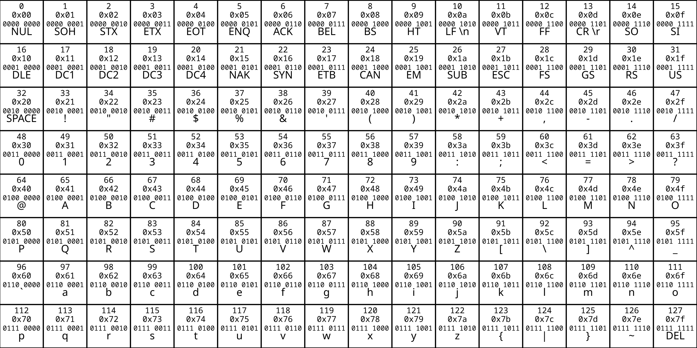

# Character Encodings

> Important: This presentation comes with code examples in a [Xcode Playground file](Playgrounds/character-encoding.playground)

## **1. Definition**

**Character encoding** is the process of assigning numbers to graphical characters, especially the written characters of human language, allowing them to be stored, transmitted, and transformed using computers. The numerical values that make up a character encoding are known as code points.

A **character set** is a standardized mapping between characters (letters, numbers, symbols) and numeric codes that computers can process. It ensures consistent text representation across devices, platforms, and applications.

### **Encodings:**

- **ASCII**: American Standard Code for Information Interchange, Introduced in 1960, 8 bit encoding.
 33 first chars are [Code control](https://en.wikipedia.org/wiki/Control_character) and 95 of the encoded characters are printable: these include the digits 0 to 9, lowercase letters a to z, uppercase letters A to Z and symbols.
last bit always remain zero for compatibility with old 7 bit systems.

  

- [**ISO/IEC 8859**](https://en.wikipedia.org/wiki/ISO/IEC_8859): is a family of standardized 8-bit character encodings developed by the International Organization for Standardization (ISO) and the International Electrotechnical Commission (IEC). It was designed to represent text in various languages by extending the 7-bit ASCII character set to include additional characters for specific alphabets or scripts, accommodating the needs of many languages. [ISO-8859-1](https://www.ascii-code.com/ISO-8859-1)

- **Unicode**: A universal character set designed to support every language and script.

---

# Unicode and Its Encodings
Unicode is an international standard for representing and processing text in computer systems. Its primary goal is to provide a unified system for encoding all written characters of the world's languages. Instead of using different encodings for different languages (such as ASCII or ISO/IEC 8859), Unicode offers a single, comprehensive system that covers nearly all known characters.

---

## Key Concepts of [Unicode](https://www.ssec.wisc.edu/~tomw/java/unicode.html)

### 1. Character
- Each character in Unicode is identified by a unique **code point**.
- Code points are typically represented in hexadecimal format as `U+XXXX`, where `XXXX` is the code point value.
- Example: The character `A` has the code point `U+0041`.

### 2. Code Planes
- Unicode divides its address space into **17 planes**, each containing 65,536 (2^16) code points.
- The most important plane is the [**Basic Multilingual Plane (BMP)**](https://symbl.cc/en/unicode-table/), which covers code points `U+0000` to `U+FFFF`.
 (0000 0000 0000 0000) - (1111 1111 1111 1111)
- Supplementary planes (Planes 1–16) cover code points from `U+10000` to `U+10FFFF`. (0001 0000 0000 0000 0000) - (0001 0000 1111 1111 1111 1111) Max is 21 bit
- Max is (2^16) * 17 = 1,114,112 chars supported by Unicode

---
## Unicode Planes

Unicode's address space is divided into 17 planes, each containing 65,536 code points:

| Plane Number | Name                          | Range               | Description                                   |
|--------------|-------------------------------|---------------------|-----------------------------------------------|
| 0            | Basic Multilingual Plane (BMP)| `U+0000` to `U+FFFF`| Covers most commonly used characters.         |
| 1            | Supplementary Multilingual Plane (SMP) | `U+10000` to `U+1FFFF` | Historical scripts, symbols, and emojis.     |
| 2            | Supplementary Ideographic Plane (SIP) | `U+20000` to `U+2FFFF` | Additional CJK (Chinese, Japanese, Korean) characters. |
| 14           | Supplementary Special-purpose Plane (SSP) | `U+E0000` to `U+EFFFF` | Special-purpose characters and tags.         |
| 15–16        | Private Use Planes            | `U+F0000` to `U+10FFFF` | Reserved for private or custom use.          |

---

### 3.Unicode Encodings

Unicode defines several encoding schemes to represent code points in binary form. The most common encodings are:

### 1. UTF-8
- **Variable-width encoding**: Uses 1 to 4 bytes per character.
- **ASCII-compatible**: The first 128 characters (U+0000 to U+007F) are encoded as single bytes, matching ASCII.
- **Efficient for text with many ASCII characters**.
- **The most popular character encoding on the World Wide Web With 98.3Percent Usage**
- Example:
  - `A` (U+0041) → `41` (1 byte)
  - `€` (U+20AC) → `E2 82 AC` (3 bytes)
  - `😊` (U+1F600) → `F0 9F 98 80` (4 bytes)

### 2. UTF-16
- **Variable-width encoding**: Uses 2 or 4 bytes per character.
- **Fixed 2 bytes for BMP characters** (U+0000 to U+FFFF).
- **Surrogate pairs** (4 bytes) for supplementary characters (U+10000 to U+10FFFF).
- Example:
  - `A` (U+0041) → `00 41` (2 bytes)
  - `€` (U+20AC) → `20 AC` (2 bytes)
  - `😊` (U+1F600) → `D8 3D DE 00` (4 bytes, surrogate pair)

### 3. UTF-32
- **Fixed-width encoding**: Uses 4 bytes per character.
- **Simple and direct**: Each code point is represented as a 32-bit integer.
- Example:
  - `A` (U+0041) → `00000041` (4 bytes)
  - `€` (U+20AC) → `000020AC` (4 bytes)
  - `😊` (U+1F600) → `0001F600` (4 bytes)

  # Why UTF-8 Uses 3 Bytes for the Euro Sign (`€`)

UTF-8 is a **variable-width encoding** that uses **1 to 4 bytes** to represent Unicode characters. The Euro sign (`€`) is encoded using **3 bytes** in UTF-8, even though it might seem like it could fit into 2 bytes. Here’s why:

---

## 1. **UTF-8 Design Principles**

UTF-8 was designed with the following goals:
- **Backward Compatibility with ASCII**: The first 128 characters (U+0000 to U+007F) are identical to ASCII and use **1 byte**.
- **Efficiency**: For text that is mostly ASCII (e.g., English), UTF-8 is very space-efficient.
---

## 2. **UTF-8 Encoding Rules**

UTF-8 uses specific bit patterns to indicate how many bytes are used for a character:

| Code Point Range         | UTF-8 Byte Sequence           | Description                          |  Bit Range  |
|--------------------------|-------------------------------|--------------------------------------|-------------|
| `U+0000` to `U+007F`     | `0xxxxxxx`                    | 1 byte (ASCII-compatible)            |     0-7     |
| `U+0080` to `U+07FF`     | `110xxxxx 10xxxxxx`           | 2 bytes                              |     8-11    |
| `U+0800` to `U+FFFF`     | `1110xxxx 10xxxxxx 10xxxxxx`  | 3 bytes                              |     12-16   |
| `U+10000` to `U+10FFFF`  | `11110xxx 10xxxxxx 10xxxxxx 10xxxxxx` | 4 bytes                      |     17-21   |

The Euro sign (`€`) has the code point `U+20AC`, which falls in the range `U+0800` to `U+FFFF`. According to the UTF-8 rules, characters in this range **must** be encoded using **3 bytes**.

---

## 3. **Why Not Use 2 Bytes for the Euro Sign?**

The Euro sign (`U+20AC`) cannot be encoded in 2 bytes in UTF-8 because:
- **2-byte UTF-8 Encoding is Reserved for a Smaller Range**: The 2-byte UTF-8 format (`110xxxxx 10xxxxxx`) can only represent code points in the range `U+0080` to `U+07FF`. This range covers 1,920 characters, which is insufficient for characters like the Euro sign.
- **The Euro Sign is Outside the 2-Byte Range**: The Euro sign (`U+20AC`) is in the range `U+0800` to `U+FFFF`, which requires **3 bytes** in UTF-8.

---

### **BOM**
The **Byte Order Mark (BOM)** is a special marker placed at the beginning of a text file or data stream to indicate:
1. **Encoding Type**: Whether the text is encoded in UTF-8, UTF-16, or UTF-32.
2. **Byte Order**: For multi-byte encodings (like UTF-16 and UTF-32), it specifies the **endianness** (byte order) of the data:
   - **Big-endian**: Most significant byte first.
   - **Little-endian**: Least significant byte first.

The BOM is optional and not always required, but it can help software correctly interpret the encoding and byte order of a text file.

---

### **BOM in Different Encodings**

#### **1. UTF-8 BOM**
- **Purpose**: In UTF-8, the BOM is optional and rarely used because UTF-8 is a **byte-order-independent** encoding (it doesn’t have endianness issues).

#### **2. UTF-16 BOM**
- **Purpose**: UTF-16 uses 2 bytes per code unit, so the byte order (endianness) matters. The BOM indicates whether the text is stored in **big-endian** or **little-endian** format.
- **BOM Values**:
  - **Big-endian**: `FE FF` (2 bytes).
  - **Little-endian**: `FF FE` (2 bytes).
- **Usage**: The BOM is commonly used in UTF-16 files to avoid ambiguity in byte order.

#### **3. UTF-32 BOM**
- **Purpose**: UTF-32 uses 4 bytes per code unit, so the byte order (endianness) is critical. The BOM indicates whether the text is stored in **big-endian** or **little-endian** format.
- **BOM Values**:
  - **Big-endian**: `00 00 FE FF` (4 bytes).
  - **Little-endian**: `FF FE 00 00` (4 bytes).
- **Usage**: The BOM is used in UTF-32 files to specify byte order.

---

### **Do We Need a BOM?**
- **UTF-8**: Not strictly necessary, as UTF-8 is byte-order-independent. However, some tools (like Microsoft Notepad) use it to explicitly mark UTF-8 files.
- **UTF-16/UTF-32**: Highly recommended, as the byte order must be specified to correctly interpret the data.

---

### 4.Advantages of Unicode

1. **Universal Coverage**: Supports nearly all known scripts and characters.
2. **Compatibility**: Backward-compatible with ASCII.
3. **Interoperability**: Enables seamless text exchange across different platforms and languages.
4. **Efficiency**: Encodings like UTF-8 are space-efficient for ASCII-heavy text.
---

## Extra links:

- https://github.com/swiftlang/swift/blob/main/stdlib/public/core/String.swift
- https://symbl.cc/en/unicode-table
