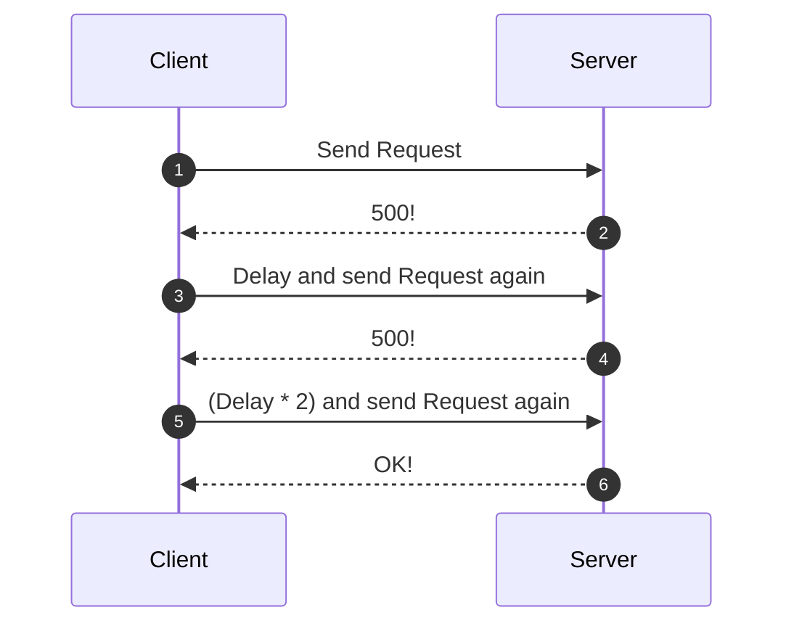

# Retry Pattern

The **Retry Pattern** is a strategy that enables an application to handle transient failures (temporary faults) when connecting to a service or network resource. By transparently retrying a failed operation, the application improves stability and resilience.

In a system design, transient issues such as network interruptions or brief service outages are common. The Retry Pattern automatically retries failed requests a set number of times before marking them as permanent failures.

# Context and Problem

Applications communicating with cloud services must handle transient faults like:

- Momentary loss of network connectivity.
- Temporary unavailability of a service.
- Timeouts due to a busy service.

Failing to manage these faults gracefully can disrupt business operations.

# Solution

Design applications to handle transient faults elegantly by introducing a retry mechanism. This approach minimizes disruptions caused by faults and improves the application's reliability.




# Retry strategies

When a failure is detected, the application can handle it using one of the following strategies:

- **Cancel**: If the failure isn't transient or retrying is unlikely to succeed, cancel the operation and report an exception.

- **Retry immediately**. For rare faults (e.g., corrupted network packets), retrying the request immediately is a valid approach.

- **Retry after delay (Exponential Backoffs)**. For common issues (e.g., connectivity problems or service overloads), introduce delays between retries. Use exponential backoff to space out retries, reducing load on the system.

# Impact on performance

The retry policy should balance business needs and performance:

- **Non-Critical Operations**: Fail fast with minimal retries to maintain application throughput. For example, in an interactive web application, display a message like "Please try again later" after a few retries.

- **Critical Operations**: Retry more times with increasing delays. For instance, in a batch processing application, a longer retry period might be acceptable.

### Aggressive Retry Risks

- Overloading busy services already running at capacity.
- Affecting application responsiveness by repeatedly retrying failing operations.

# Idempotency

Idempotent operations are safe to retry without side effects. Non-idempotent operations may cause unintended consequences if retried. For example:

- A service processes a request but fails to send a response and The retry logic assumes the request failed and sends it again, potentially causing duplicate operations.

# When to use this pattern

### Use This Pattern When:

- Transient faults are likely but short-lived.
- Retrying a previously failed request might succeed on subsequent attempts.

### Avoid This Pattern When:

- The fault is long-lasting, as retries will waste time and resources.
- Failures are caused by internal issues, such as logic errors in the application.
- Scalability problems cause frequent failures (e.g., busy faults). In this case, focus on scaling the system instead.

# Summary

The Retry Pattern enhances an application's resilience by handling transient faults transparently. When implementing this pattern:

- Choose a suitable retry strategy (e.g., cancel, immediate retry, or exponential backoff).
- Ensure retries are safe for idempotent operations.
- Avoid aggressive retry policies that degrade performance.

Careful tuning of retry policies ensures that applications balance fault tolerance with responsiveness and system stability.


# Example

```swift
import Foundation

/// A protocol defining the retry policy for handling transient errors.
protocol RetryPolicy {
    /// The maximum number of retry attempts.
    var maxAttempts: Int { get }
    
    /// Calculates the delay in seconds before the next retry.
    /// - Parameter attempt: The current retry attempt.
    /// - Returns: The delay in seconds before the next attempt.
    func delay(for attempt: Int) -> TimeInterval
    
    /// Determines whether a task should be retried based on the given error.
    /// - Parameter error: The error that occurred.
    /// - Returns: `true` if the task should be retried; otherwise, `false`.
    func shouldRetry(for error: Error) -> Bool
}

/// A retry policy that implements exponential backoff strategy.
struct ExponentialBackoffPolicy: RetryPolicy {
    let maxAttempts: Int
    let initialDelay: TimeInterval
    
    /// Calculates an exponential delay for the given attempt.
    /// - Parameter attempt: The current retry attempt.
    /// - Returns: The delay in seconds.
    func delay(for attempt: Int) -> TimeInterval {
        return initialDelay * pow(2, Double(attempt - 1))
    }
    
    /// Determines whether the error should trigger a retry.
    /// - Parameter error: The error encountered.
    /// - Returns: `true` if the error is transient and should be retried.
    func shouldRetry(for error: Error) -> Bool {
        // Example: Retry for specific network-related errors.
        if let urlError = error as? URLError {
            return urlError.code == .timedOut || urlError.code == .cannotFindHost
        }
        return false
    }
}

/// A class responsible for executing tasks with a retry policy.
class RetryHandler {
    private let policy: RetryPolicy
    
    /// Initializes the retry handler with the given retry policy.
    /// - Parameter policy: The retry policy to apply.
    init(policy: RetryPolicy) {
        self.policy = policy
    }
    
    /// Executes a task with retries based on the policy.
    /// - Parameter task: The asynchronous task to execute.
    /// - Returns: A `Result` containing either the task's success or failure.
    func execute<T>(
        task: @escaping () async throws -> T
    ) async -> Result<T, Error> {
        var attempt = 0
        
        while attempt < policy.maxAttempts {
            attempt += 1
            
            do {
                // Attempt to execute the task.
                let result = try await task()
                return .success(result) // Task succeeded.
            } catch {
                // Check if retries should stop.
                if attempt >= policy.maxAttempts || !policy.shouldRetry(for: error) {
                    return .failure(error) // Stop retrying and return the error.
                }
                
                // Calculate delay before the next attempt.
                let delay = policy.delay(for: attempt)
                try? await Task.sleep(nanoseconds: UInt64(delay * 1_000_000_000))
            }
        }
        
        // This point should not be reached due to the logic above.
        return .failure(NSError(domain: "RetryHandler", code: -1, userInfo: [NSLocalizedDescriptionKey: "Retry attempts exceeded"]))
    }
}

/// A mock network request function that simulates transient failures.
/// - Throws: A `URLError` with `.timedOut` error randomly.
/// - Returns: A success message string.
func mockNetworkRequest() async throws -> String {
    if Bool.random() {
        throw URLError(.timedOut) // Simulate a transient failure.
    }
    return "Success: Data retrieved!" // Simulate success.
}

/// Entry point of the application demonstrating the Retry Pattern.
struct RetryPatternExample {
    func main() async {
        // Define an exponential backoff retry policy.
        let retryPolicy = ExponentialBackoffPolicy(maxAttempts: 3, initialDelay: 1.0)
        
        // Create a retry handler with the policy.
        let retryHandler = RetryHandler(policy: retryPolicy)
        
        // Execute the mock network request with retry logic.
        let result = await retryHandler.execute {
            try await mockNetworkRequest()
        }
        
        // Handle the result of the operation.
        switch result {
        case .success(let data):
            print(data) // Output: "Success: Data retrieved!"
        case .failure(let error):
            print("Error: \(error.localizedDescription)") // Output: Error details after retries.
        }
    }
}

// Executes the retry logic for a mock network request using the main() function.
let retryPatternExample = RetryPatternExample()
await retryPatternExample.main()
```

# Resouces

- [Microsoft Docs: Retry Pattern](https://learn.microsoft.com/en-us/azure/architecture/patterns/retry)
- [Resilience4j - github](https://github.com/resilience4j/resilience4j)
- [Architectural Patterns: Retry](https://medium.com/gett-engineering/architectural-patterns-retry-a83bdac19146)
- [Understanding Retries, Exponential Backoffs, and Circuit Breakers in Distributed Systems](https://dilankam.medium.com/understanding-retries-exponential-backoffs-and-circuit-breakers-in-distributed-systems-4355db103505)
- [Retry Pattern in Microservices](https://www.geeksforgeeks.org/retry-pattern-in-microservices/)
